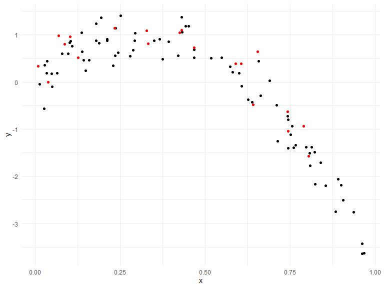

Cross Validation
================
Alexis
11/8/2019

## Cross validation

Generate a dataset

``` r
nonlin_df = 
  tibble(
    id = 1:100,
    x = runif(100, 0, 1),
    y = 1 - 10 * (x - .3) ^ 2 + rnorm(100, 0, .3)
  )

nonlin_df %>% 
  ggplot(aes(x = x, y = y)) + 
  geom_point() 
```


Training and testing. split full dataset into training and testing

``` r
train_df = sample_frac(nonlin_df, size = .8)
test_df = anti_join(nonlin_df, train_df, by = "id")
 
ggplot(train_df, aes(x = x, y = y)) + 
  geom_point() + 
  geom_point(data = test_df, color = "red")
```



Fit three models of varying goodness.

``` r
linear_mod = lm(y ~ x, data = train_df)
smooth_mod = mgcv::gam(y ~ s(x), data = train_df)
wiggly_mod = mgcv::gam(y ~ s(x, k = 30), sp = 10e-6, data = train_df)
```

Let’s look at some fits

``` r
train_df %>%
  add_predictions(linear_mod) %>%
  ggplot(aes(x = x, y = y)) +
  geom_point() +
  geom_line(aes(y = pred), color = "red")
```


``` r
train_df %>%
  add_predictions(smooth_mod) %>%
  ggplot(aes(x = x, y = y)) +
  geom_point() +
  geom_line(aes(y = pred), color = "red")
```


``` r
train_df %>%
  add_predictions(wiggly_mod) %>%
  ggplot(aes(x = x, y = y)) +
  geom_point() +
  geom_line(aes(y = pred), color = "red")
```


cross validation: make predictions on testing dataset and compute root
mean squared error on that testing dataset

smaller numbers are better pick the model that fits the testing dataset
better; training dataset has too much stuff

``` r
rmse(linear_mod, test_df)
```

    ## [1] 0.7137237

``` r
rmse(smooth_mod, test_df)
```

    ## [1] 0.2534611

``` r
rmse(wiggly_mod, test_df)
```

    ## [1] 0.3334082

## Do this all using `modelr`

data frame of 20% testing, 80% training & how many times you want to do
cross validation

``` r
cv_df  =
  crossv_mc(nonlin_df, 100)
```

one note about resample …

``` r
cv_df %>% pull(train) %>% .[[1]] %>% 
  as_tibble
```

    ## # A tibble: 79 x 3
    ##       id      x      y
    ##    <int>  <dbl>  <dbl>
    ##  1     1 0.343   0.681
    ##  2     2 0.681  -0.246
    ##  3     3 0.586   0.409
    ##  4     4 0.0859  0.432
    ##  5     6 0.209   0.921
    ##  6     7 0.818  -1.52 
    ##  7     9 0.840  -1.41 
    ##  8    11 0.831  -2.03 
    ##  9    12 0.464   0.256
    ## 10    13 0.0737  0.743
    ## # ... with 69 more rows

``` r
cv_df =
  cv_df %>% 
  mutate(
    train = map(train, as_tibble),
    test = map(test, as_tibble))
```

Try fitting the linear model to all of these

``` r
cv_results =
  cv_df %>%
  mutate(
    linear_mods = map(.x = train, ~lm(y ~ x, data = .x)),
    smooth_mods = map(.x = train, ~gam(y ~ s(x), data = .x)),
    wiggly_mod = map(.x = train, ~gam(y ~ s(x, k = 30), sp = 10e-6, data = .x)),
    
     rmse_lin = map2_dbl(.x = linear_mods, .y = test, ~rmse(.x, .y)),
     rmse_smo = map2_dbl(.x = smooth_mods, .y = test, ~rmse(.x, .y)),
     rmse_wiggly = map2_dbl(wiggly_mod, test, ~rmse(model = .x, data = .y))
  )
```

we can see that smooth fits seem to generally be doing better than
linear fits, often by a factor of about 2 or 3

visualize this

``` r
cv_results %>% 
  select(starts_with("rmse")) %>% 
  pivot_longer(
    everything(),
    names_to = "model", 
    values_to = "rmse",
    names_prefix = "rmse_") %>% 
  mutate(model = fct_inorder(model)) %>% 
  ggplot(aes(x = model, y = rmse)) + geom_violin()
```


based on these resuls, pick smooth model
